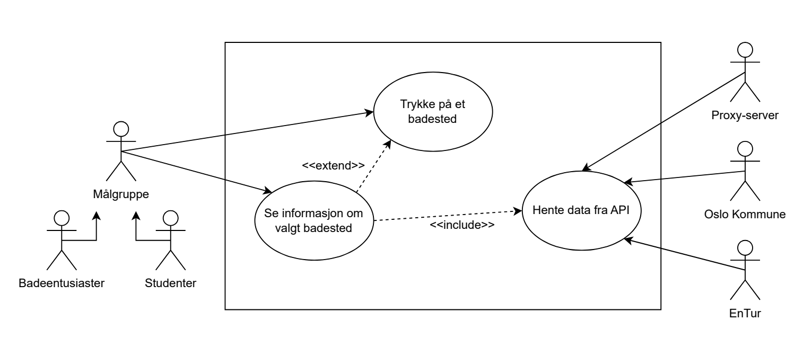
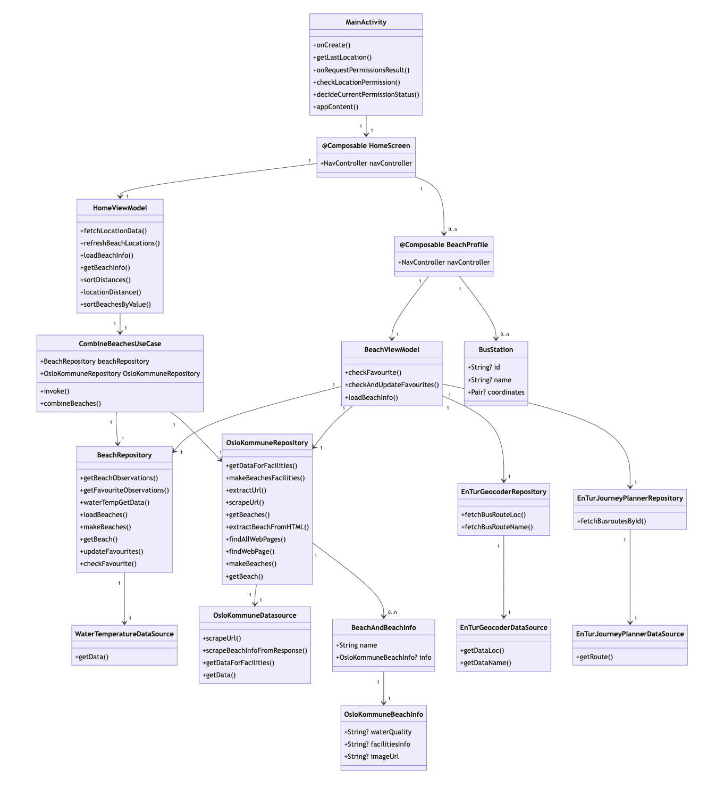
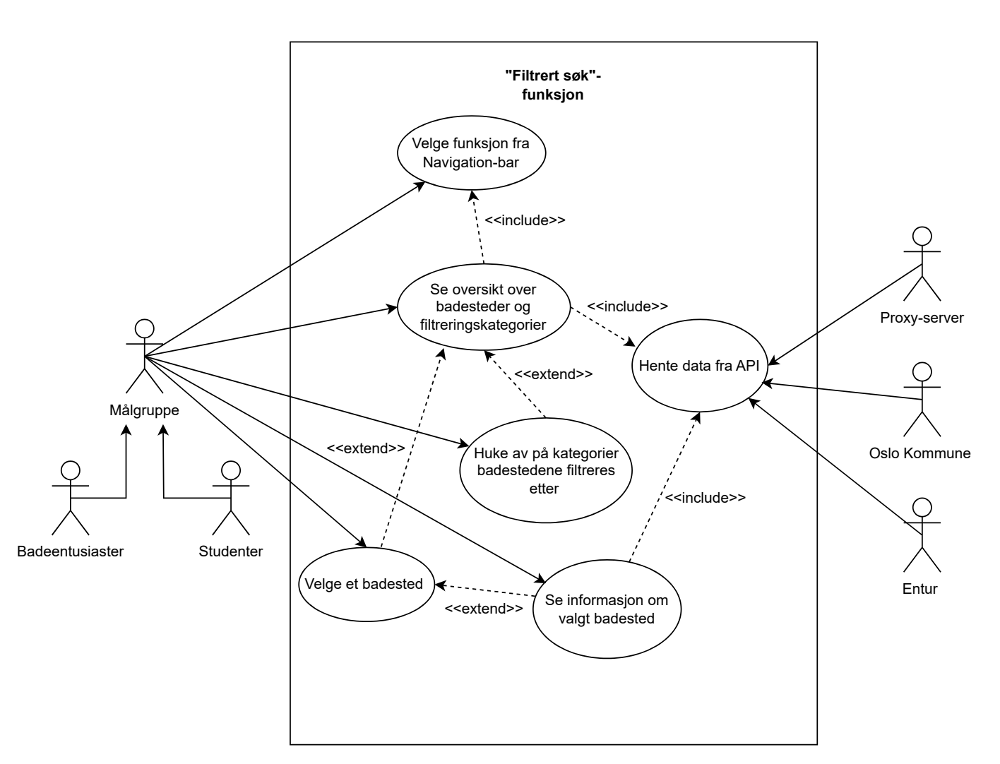
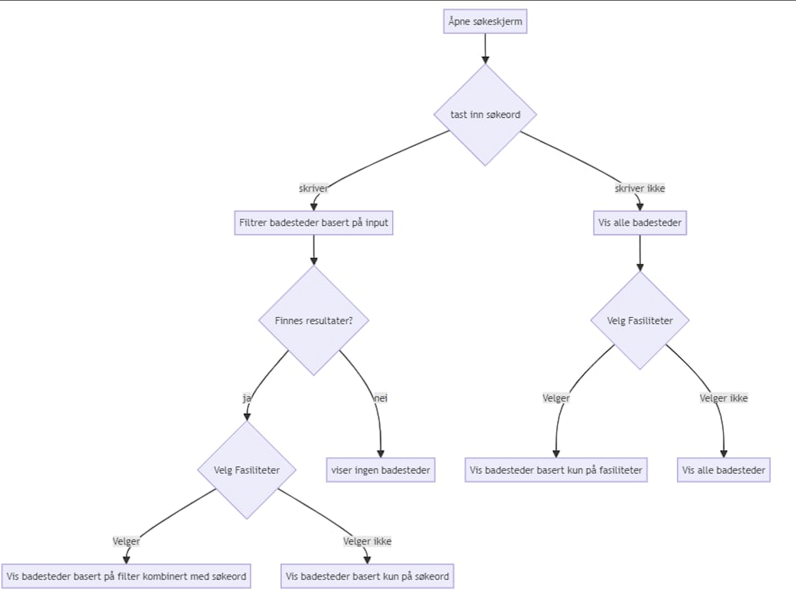
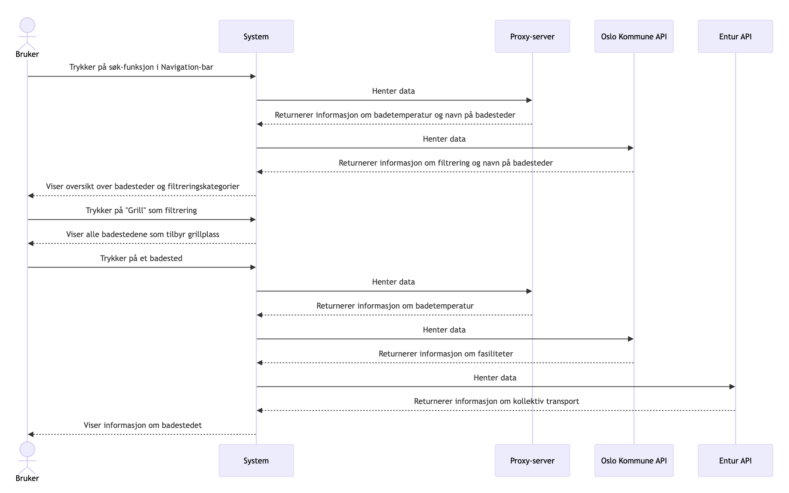
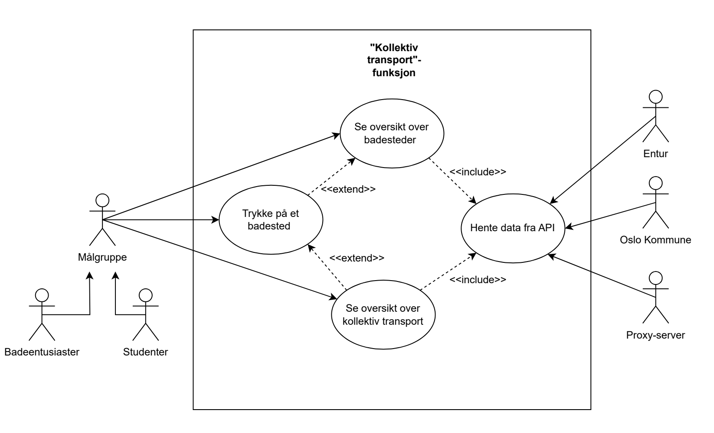
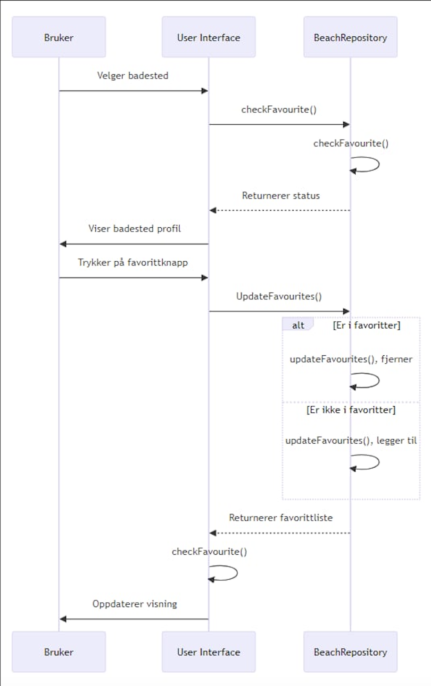
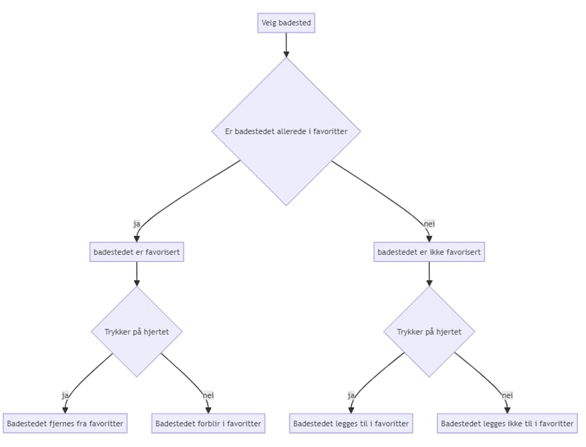

# Applikasjonens funksjonelle krav 
Applikasjonen vår tilbyr en rekke ulike funksjonaliteter, der de viktigste er; visning av badestedsinformasjon, filtrert søk, visning av kollektivtransport, favorisering av badesteder og visning av nærmeste badesteder. 

## Funksjonalitet: Visning av badestedsinformasjon 
Når brukeren trykker på et badested, presenteres de for nyttig informasjon om det aktuelle badestedet. Dersom dette er tilgjengelig, inneholder visningen informasjon om vannkvalitet, badetemperatur, fasiliteter og kollektivruter. 

### Tekstlig beskrivelse 
1. Brukeren får en oversikt over badesteder 
2. Brukeren velger et badested 
3. Systemet henter informasjon om badestedet fra API-er 
4. Brukeren får tilgjengelig informasjon om badestedet (vannkvalitet, badetemperatur, fasiliteter og kollektivruter) 

### Use Case-diagram 

### Klassediagram

## Funksjonalitet: Filtrert søk 
Applikasjonen tilbyr filtrering av søk slik at brukerne kan filtrere badestedene etter ulike fasilitetskategorier (hentet fra Oslo Kommune) som de blir presentert for; badevakt, barnevennlig, grill, kiosk, tilpasset bevegelseshemmede, toalett og badebrygge. Dersom flere fasiliteter blir huket av, presenteres krysningen av resultatene fra hvert valgte fasilitetskategori. 

### Tekstlig beskrivelse 
1. Brukeren går inn til funksjonen gjennom Navigation-bar 
2. Systemet henter badestedene i Oslo fra API-er 
3. Brukeren får en oversikt over badesteder i Oslo og ulike filtreringskategorier (fasiliteter) 
4. Brukeren trykker på kategorier som badestedene filtreres etter 
5. Systemet viser oversikt over badestedene som kun går under disse kategoriene
6. Brukeren trykker på ett av de resulterende badestedene 
7. Systemet henter informasjon om badestedet fra API-er 
8. Brukeren får tilgjengelig informasjon om badestedet (vannkvalitet, badetemperatur, fasiliteter og kollektivruter) 

### Use Case-diagram

### Tilstandsdiagram

### Sekvensdiagram

### Klassediagram 

## Funksjonalitet: Visning av kollektivtransport
Når brukeren trykker på et badekort, vises det et utvalg av kollektivtransport brukeren kan benytte seg av for å komme seg til badestedet. 

### Tekstlig beskrivelse 
1. Brukeren får en oversikt over badesteder 
2. Brukeren trykker på et badested 
3. Systemet henter informasjon om badestedet fra API-er 
4. Brukeren får en oversikt over kollektivruter i nærheten av badestedet 

### Use Case-diagram

## Funksjonalitet: Legge til favoritter 
Applikasjonen gir brukeren muligheten til å favorisere badesteder, som gjøres ved å trykke på hjerteikonet inne på valgt badestedsprofil. Disse badestedene blir lagt inn i en egen skjerm slik at det blir lettere for brukeren å finne fram til dem på et senere tidspunkt. Badestedene kan også enkelt fjernes fra favoritter dersom det er ønskelig. Dette gjøres ved å trykke på hjerteikonet som allerede har blitt trykket på. 

### Tekstlig beskrivelse 
**Hovedflyt**
1. Brukeren velger et badested 
2. Systemet viser badestedsprofil 
3. Brukeren trykker på hjerteikonet 
4. Systemet legger til badestedet i favoritter

**Alternativ flyt 1, steg 4:** Badestedet er allerede i favoritter \
A1.1. Systemet fjerner badestedet fra favoritter 

### Sekvensdiagram

### Tilstandsdiagram

## Funksjonalitet: Visning av nærmeste badesteder 
Hvis brukeren tillater stedstilgang, blir badestedene sortert etter avstand. På denne måten kan brukerne lett finne fram til sine nærmeste badesteder uten å måtte scrolle langt. Hvis brukeren derimot avslår stedstilgang, blir badestedene sortert alfabetisk.

### Tekstlig beskrivelse 
**Hovedflyt**
1. Systemet ber om stedstilgang 
2. Brukeren godtar forespørselen 
3. Brukeren får en oversikt over badesteder sortert etter avstand 

**Alternativ flyt 1, steg 2:** Brukeren avslår forespørselen \
A1.1. Brukeren får en oversikt over badesteder i alfabetisk rekkefølge \
Avslutt flyt 

### Sekvensdiagram

